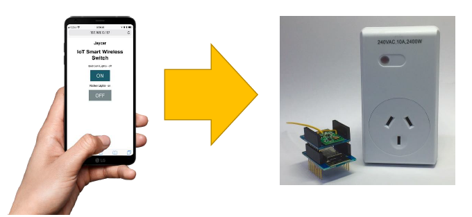
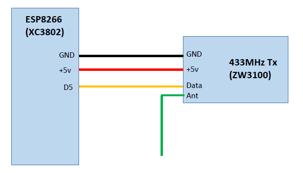
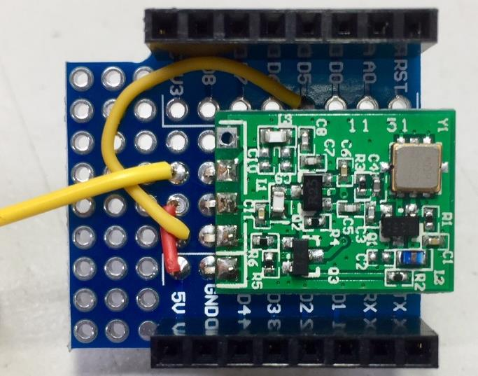
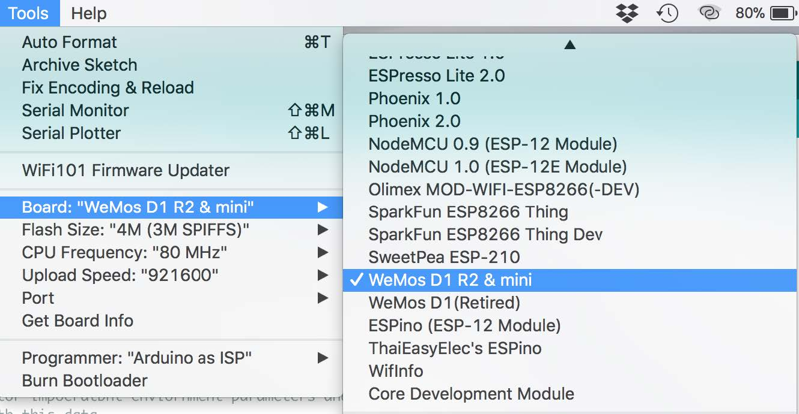
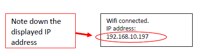
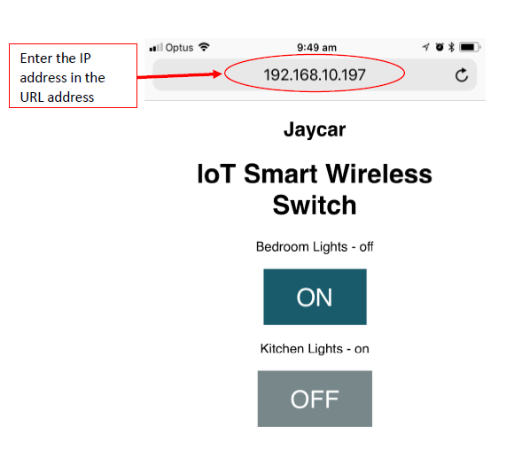
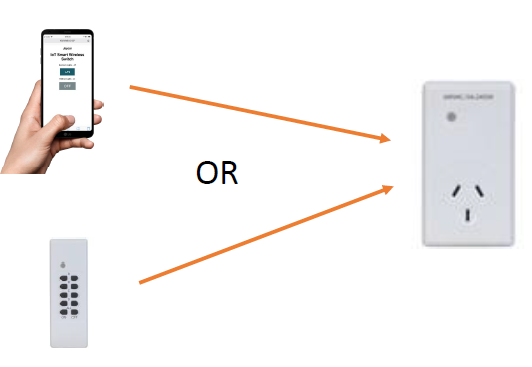

# IoT Smart Wireless Switch



Here is a great project to get started with your very own IoT (Internet of Things) home automation project. Based on the tiny yet powerful ESP8266 integrated WiFi and MCU (Microcontroller Unit) you can turn on or off appliances using your smart phone or tablet. Once you become familiar with the source code (provided with the project documentation) you will be able to create your very own innovations.

## Before you start:

In order for the IoT Smart Warless Switch to work you need to have good WiFi coverage and your smart phone (or tablet) needs to be connected to the same WiFi network as the IoT Smart Warless Switch.

## Components:
|Qty| Code | Description |
|---|---|---|
|1 | [XC3802](http://jaycar.com.au/p/XC3802) | ESP8266 main board
|1 | [XC3850](http://jaycar.com.au/p/XC3850) | prototyping shield for ESP8266
|1 | [ZW3100](http://jaycar.com.au/p/ZW3100) | 433Mhz transmitter
|1 | [MS6148](http://jaycar.com.au/p/MS6148) | Switch RF Mains

* You’ll also need about 30cm of wire.

## Circuit & Construction

The figure below shows the circuit diagram, there is not much wiring to this project, only three wires between the ESP8266 and the 433MHz transistor unit, plus another wire that acts as an antenna.



The components can constructed in any way that is convenient for your application, we have chosen to use the WiFi Mini shield (XC3850) because it offers a neat way to interface to the ESP8266 D1 main board.



## Source Code & Operation

Open the project source file in the Arduino IDE. Change the following para meters to your WiFi network SSID and password:

```c
cost char* ssid = "<your WiFi SSID here>";
cost char* password = "<your WiFi password here>";
```
*Note: Include the "" in the above variables.*

Make sure you have selected the correct target board, under the 'Tools' menu:



Make sure the you have connected the ESP8266 board to your computer and you have selected the correct USB port. Now upload the source code to your ESP8266.

After the upload operation is completed, under the 'Tools' tab, click on 'Serial Monitor' to open a serial monitor window (make sure the data rate is set to 115200 baud). You will be promoted with the WiFi connection status as shown below;



Write down the IP address that appears on your screen, in the above example this is `192.168.10.197` (this will be different for your network).

On your smart phone or tablet (or any PC for that matter) open a new WEB browser such as Microsoft Edge, Google Chrome, etc., in the URL address enter the IP address you noted from Step 3 above. Now you should see the IoT Smart Wireless Switch control screen, as shown below.



In the sample code we called the first switch “Bedroom Lights” and the second “Kitchen Lights”, you can customise these labels by locating and editing the following code;

```c
// Display current state, and ON/OFF buttons for Switch 1
client.println("<p>Bedroom Lights - " + output_1_State + "</p>");
// Display current state, and ON/OFF buttons for Switch 2
client.println("<p>Kitchen Lights - " + output_2_State + "</p>");
```
Now all you need to do is to pair your IoT Smart Wireless Switch with the mains power unit. This is a very easy operation; all you need to do is follow the steps below;

1. Make sure the main power unit is unplugged

2. Now insert the main power unit to the mains power. You will see the red light flashing; this indicates that the unit is ready to pair.

3. On your smart phone control screen click either the first of second "On" button. Wait until the command is completed. Now you should see the red light on the mains unit stay on (stop flashing).

That’s it, your IoT Smart controller is now paired with your mains power unit. You should be able to now switch the power unit on or off by clicking on the control screen button. Note that only the button you paired in step (iii) above will be connected to the mains unit. You can add another mains unit and pair it to the second button, you can even modify the code to add more mains controllers.

## Tips & Tricks

You can continue to use the remote control unit that is provided with your RF Mains Switch (MS6148), so at your convenience you can control lights or appliances ON or OFF using your IoT Smart Wireless switch (via your phone or any browser) or using the provided remote control unit.


